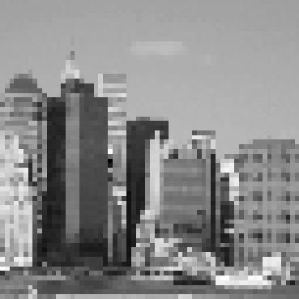
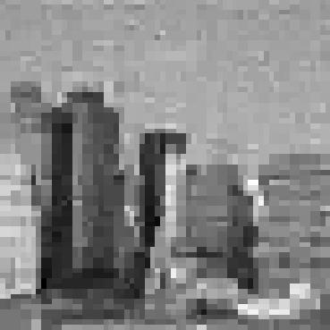
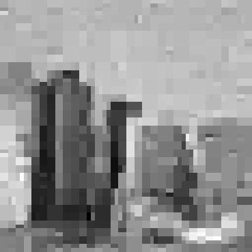

 [](https://opensource.org/licenses/MIT)  [](https://mrina.readthedocs.io/en/latest/?badge=latest)

# MRIna: A library for MRI Noise Analysis

MRIna is a library for the analysis of reconstruction noise from undersampled 4D flow MRI. For additional details, please refer to the publication below:

Lauren Partin, [Daniele E. Schiavazzi](https://www3.nd.edu/~dschiava/) and [Carlos A. Sing-Long Collao](https://www.ing.uc.cl/academicos-e-investigadores/carlos-alberto-sing-long-collao/), *An analysis of reconstruction noise from undersampled 4D flow MRI* [arXiv](http://arxiv.org/abs/2201.03715)

The complete set of results from the above paper can be found [at this link](https://notredame.box.com/s/fdrd3e3du555u1ikarrfkvt3jsxddwe9)

---

## Installation and documentation

You can install MRIna with pip ([link to PyPI](https://pypi.org/project/mrina/))
```
pip install PyWavelets mrina
```

For the documentation follow this [link](https://mrina.readthedocs.io/en/latest/).

---

## What you can do with MRIna.

The MRIna library provides the following functionalities.

- It generates k-space undersampling masks of various types including **Bernoulli**, **variable density triangular**, **variable density Gaussian**, **variable density exponential** and **Halton** quasi-random sequences. 
- It supports arbitrary operators that implement a forward call (**eval**), and inverse call (**adjoint**), column restriction (**colRestrict**), **shape** and **norm**.
- It supports various **non-linear reconstruction methods** including l1-norm minimization with iterative thresholding and orthogonal matching pursuit based greedy heuristics.
- It provides a number of scripts to 
 
  + generate ensembles of synthetic, subsampled and noisy k-space images (4 complex images);
  + reconstruct image density and velocities;
  + post-process to compute correlations, MSE, error patterns and relative errors.

---

## Single-image examples

Example of recovering a 64x64 pixel image from its undersampled frequency information using a Gaussian mask in k-space, 75% undersampling (only 1 every 4 frequencies is retained) and adding a SNR equal to 50.

<table>
  <tr>
    <td>Original image</td>
    <td> </td>
    <td>Wavelet transform</td>
    <td> </td>
  </tr> 
  <tr>
    <td>k-space mask</td>  
    <td> </td>
    <td>Noisy k-space measurements</td>  
    <td> </td>
  <tr>
    <td>Noiseless reconstruction: </td>  
    <td> </td>
    <td>Reconstruction: CS</td>  
    <td> </td>
  </tr>
  <tr>
    <td>Reconstruction: CSDEB</td>    
    <td> </td>    
    <td>Reconstruction: stOMP</td>  
    <td> </td>    
  </tr>
</table>

### Read grayscale image
```python
import cv2
im = cv2.imread('city.png', cv2.IMREAD_GRAYSCALE)/255.0
```
### Generate undersampling mask
```python
from mrina import generateSamplingMask

# Set an undesampling ratio (refers to the frequencies that are dropped)
delta = 0.75
# Generate an undersampling mask
omega = generateSamplingMask(im.shape, delta, 'bernoulli')
# Verify the undersampling ratio
nsamp = np.sum((omega == 1).ravel())/np.prod(omega.shape)
print('Included frequencies: %.1f%%' % (nsamp*100))
```
### Compute and show wavelet representation
```python
import pywt

waveName = 'haar'
waveMode = 'zero'
wim = pywt.coeffs_to_array(pywt.wavedec2(im, wavelet=waveName, mode=waveMode))[0]
plt.figure(figsize=(8,8))
plt.imshow(np.log(np.abs(wim)+1.0e-5), cmap='gray')
plt.axis('off')
plt.show()
```
### Initialize a WaveletToFourier operator and generate noiseless k-space measurements
```python
from mrina import OperatorWaveletToFourier

# Create a new operator
A = OperatorWaveletToFourier(im.shape, samplingSet=omega[0], waveletName=waveName)
yim = A.eval(wim, 1)
```
### Noiseless recovery using l1-norm minimization
```python
from mrina import RecoveryL1NormNoisy

# Recovery - for low values of eta it is better to use SoS-L1Ball
wimrec_cpx, _ = RecoveryL1NormNoisy(0.01, yim, A, disp=True, method='SoS-L1Ball')
# The recovered coefficients could be complex.
imrec_cpx = A.getImageFromWavelet(wimrec_cpx)
imrec = np.abs(imrec_cpx)
```
### Generate noise in the frequency domain
```python
# Target SNR
SNR = 50
# Signal power. The factor 2 accounts for real/imaginary parts
yim_pow = la.norm(yim.ravel()) ** 2 / (2 * yim.size)
# Set noise standard deviation
sigma = np.sqrt(yim_pow / SNR)
# Add noise
y = yim + sigma * (np.random.normal(size=yim.shape) + 1j * np.random.normal(size=yim.shape))
```
### Image recovery with l1-norm minimization
```python
# Set the eta parameter
eta = np.sqrt(2 * y.size) * sigma
# Run recovery with CS
wimrec_noisy_cpx, _ = RecoveryL1NormNoisy(eta, y, A, disp=True, disp_method=False, method='BPDN')
# The recovered coefficients could be complex...
imrec_noisy = np.abs(A.getImageFromWavelet(wimrec_noisy_cpx))
```
### Estimator debiasing 
```python
# Get the support from the CS solution
wim_supp = np.where(np.abs(wimrec_noisy_cpx) > 1E-4 * la.norm(wimrec_noisy_cpx.ravel(), np.inf), True, False)
# Restrict the operator
Adeb = A.colRestrict(wim_supp)
# Solve a least-squares problem
lsqr = lsQR(Adeb)  
lsqr.solve(y[Adeb.samplingSet])
wimrec_noisy_cpx_deb = np.zeros(Adeb.wavShape,dtype=np.complex)
wimrec_noisy_cpx_deb[Adeb.basisSet] = lsqr.x[:]
# The recovered coefficients could be complex...
imrec_noisy_deb = np.abs(Adeb.getImageFromWavelet(wimrec_noisy_cpx_deb))
```
### Image recovery with stOMP
```python
from mrina import lsQR,OMPRecovery
# Run stOMP recovery
wimrec_noisy_cpx, _ = OMPRecovery(A, y)
# The recovered coefficients could be complex...
imrec_noisy_cpx = A.getImageFromWavelet(wimrec_noisy_cpx)
imrec_noisy = np.abs(imrec_noisy_cpx)
```
---

## Script functionalities 

MRIna also provides scripts to automate:

- the generation of noisy k-space signals.
- linear and non-linear image reconstruction.
- post-processing of reconstructed images.

### Image data

The image data should be stored on a numpy tensor in *npy* format with shape (r, i, n, im_1, im_2), where:

+ r is the number of image repetitions.
+ i is the image number. For 4D flow MRI you need 4 images, i.e., one density and three velocity components. 
+ n has a single index.
+ im_1,im_2 are the two image dimensions.

The image file name is typically *imgs_n1.npy*.

### Common parameters

For the example below, the following parameters are specified

```sh
FOLDER="./" # Folder name, here a single folder is used for all tasks
REALIZATIONS=3 # Number of realizations
IMGNAME="imgs_n1" # Name is the original image
SAMPTYPE="vardengauss" # Undersampling mask pattern
UVAL=0.75 # Undersampling ratio (75% frequencies dropped) 
NOISEVAL=0.1 # Noise internsity as a fraction of the average k-space signal norm
PROCESSES=1 # Number of parallel processes for reconstruction (shared memory only)
SOLVERMODE=2 # Recovery algorithm (0-CS, 1-CSDEB, 2-OMP)
METHOD="omp"  # Recovery algorithm (cs, csdeb or omp)
WAVETYPE="haar" # Selected wavelet frame
PRINTLEV=1 # Print level (the larger the more verbose)
NUMPOINTS=10 # Number of poits pairs for computing currelation
```
### Sample generation
```sh
python -m mrina.gen_samples --fromdir $FOLDER \
                            --repetitions $REALIZATIONS \
                            --origin $IMGNAME \
                            --dest $FOLDER \
                            --utype $SAMPTYPE \
                            --urate $UVAL \
                            --noisepercent $NOISEVAL
```
For additional information on the script input parameters, type
```
python -m mrina.gen_samples --help
```
### Image recovery from noisy and undersampled k-space signal
```sh
python -m mrina.recover --noisepercent $NOISEVAL \
                        --urate $UVAL \
                        --utype $SAMPTYPE \
                        --repetitions $REALIZATIONS \
                        --numprocesses $PROCESSES \
                        --fromdir $FOLDER \
                        --recdir $FOLDER \
                        --maskdir $FOLDER \
                        --method $SOLVERMODE \
                        --wavelet $WAVETYPE \
                        --savevels
```
For additional information on the script input parameters, type
```
python -m mrina.recover --help
```
### Post-processing - Saving reconstructed images
```sh
python -m mrina.save_imgs --numsamples $REALIZATIONS \
                          --maindir $FOLDER \
                          --recdir $FOLDER \
                          --maskdir $FOLDER \
                          --outputdir $FOLDER \
                          --savetrue \
                          --savemask \
                          --saverec \
                          --savenoise \
                          --savelin \
                          --usetrueasref \
                          --printlevel $PRINTLEV \
                          --savelin
```
For additional information on the script input parameters, type
```
python -m mrina.saveimgs --help
```
### Post-processing - Computing correlations
```sh
python -m mrina.correlation --numsamples $REALIZATIONS \
                            --numpts $NUMPOINTS \
                            --maxcorrpixeldist 10 \
                            --recdir $FOLDER \
                            --ptsdir $FOLDER \
                            --vencdir $FOLDER \
                            --maindir $FOLDER \
                            --printlevel 1
```
For additional information on the script input parameters, type
```
python -m mrina.correlation --help
```
### Post-processing - Plot correlations
```sh
python -m mrina.plot_corr --noise $NOISEVAL \
                          --uval $UVAL \
                          --utype $SAMPTYPE \
                          --method $METHOD \
                          --wavelet $WAVETYPE \
                          --numsamples $REALIZATIONS \
                          --numpts $NUMPOINTS \
                          --dir $FOLDER \
                          --outputdir $FOLDER \
                          --printlevel 1

```
For additional information on the script input parameters, type
```
python -m mrina.plot_corr --help
```
### Post-processing - Compute MSE and relative errors
```sh
python -m mrina.plot_mse --noise $NOISEVAL \
                         --uval $UVAL \
                         --utype $SAMPTYPE \
                         --method $METHOD \
                         --wavelet $WAVETYPE \
                         --numsamples $REALIZATIONS \
                         --numpts $NUMPOINTS \
                         --dir $FOLDER \
                         --outputdir $FOLDER \
                         --maskdir $FOLDER \
                         --usecompleximgs \
                         --addlinearrec \
                         --usetrueimg \
                         --printlevel 1
```
For additional information on the script input parameters, type
```
python -m mrina.plot_mse --help
```
## Core Dependencies
* Python 3.6.5
* [PyWavelets](https://pywavelets.readthedocs.io/en/latest/) 1.1.1
* [Numpy](https://numpy.org/) 1.18.1
* [Scipy](https://www.scipy.org/) 1.1.0
* [Matplotlib](https://matplotlib.org/) 3.1.0
* [Cython](https://cython.org/)
* [opencv](https://opencv.org/)

## Citation
Did you find this useful? Cite us using:
```
@misc{partin2022analysis,
      title={An analysis of reconstruction noise from undersampled 4D flow MRI}, 
      author={Lauren Partin and Daniele E. Schiavazzi and Carlos A. Sing Long},
      year={2022},
      eprint={2201.03715},
      archivePrefix={arXiv},
      primaryClass={eess.IV}
}
```
