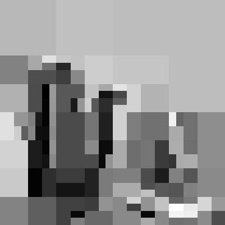

## MRIna: A library for MRI Noise Analysis

MRIna is a library for the analysis of reconstruction noise for 
Modeling noise random fields generated from  [[ArXiv](link_here)]

[Lauren Hensley Partin](), [Daniele E. Schiavazzi](https://www3.nd.edu/~dschiava/) and [Carlos A. Sing-Long Collao](https://www.ing.uc.cl/academicos-e-investigadores/carlos-alberto-sing-long-collao/)


The complete set of results from the above paper can be found [at this link](https://notredame.box.com/s/fdrd3e3du555u1ikarrfkvt3jsxddwe9)

---

### What you can do with MRIna.

The mrina library provides functionalities to 

- Generate k-space undersampling masks of various types including *Bernoulli*, *variable density triangular*, *variable density Gaussian*, *variable density exponential* and *Halton* quasi-random. 
- Supports 
- 
- 
- 
- 

---


### Examples for single-image processing

| Original Image |  |
| Wavelet transform |  |
| k-space mask |  |
| k-space noisy measurements |  |
| Reconstruction: noiseless |  |
| Reconstruction: CS |  |
| Reconstruction: CSDEB |  |
| Reconstruction: OMP |  |

#### Read grayscale image
```python
import cv2
im = cv2.imread('city.png', cv2.IMREAD_GRAYSCALE)/255.0
```
#### Read grayscale image
```python
from mrina import generateSamplingMask

# Select an undesampling ratio
delta = 0.25
# Generate an undersampling mask
omega = generateSamplingMask(im.shape, delta, 'bernoulli')
# Verify the undersampling ratio
nsamp = np.sum((omega == 1).ravel())/np.prod(omega.shape)
print('Included frequencies: %.1f%%' % (nsamp*100))
```
#### Read grayscale image
```python
import pywt

waveName = 'haar'
waveMode = 'zero'
wim = pywt.coeffs_to_array(pywt.wavedec2(im, wavelet=waveName, mode=waveMode))[0]
plt.figure(figsize=(8,8))
plt.imshow(np.log(np.abs(wim)+1.0e-5), cmap='gray')
plt.axis('off')
plt.show()
```
#### Initialize a WaveletToFourier operator and generate undersampled k-space measurements
```python
from maps import OperatorWaveletToFourier

A = OperatorWaveletToFourier(im.shape, samplingSet=omega[0], waveletName=waveName)
yim = A.eval(wim, 1)
```
#### Noiseless recovery using l1-norm minimization
```python
from solver_l1_norm import RecoveryL1NormNoisy

# Recovery - for low values of eta it is better to use SoS-L1Ball
wimrec_cpx, _ = RecoveryL1NormNoisy(0.01, yim, A, disp=True, method='SoS-L1Ball')
# The recovered coefficients could be complex!
imrec_cpx = A.getImageFromWavelet(wimrec_cpx)
imrec = np.abs(imrec_cpx)
```
#### Generate k-space noise
```python
# Target SNR
SNR = 50
# Signal power. The factor 2 accounts for real/imaginary parts
yim_pow = la.norm(yim.ravel()) ** 2 / (2 * yim.size)
# Noise st. dev.
sigma = np.sqrt(yim_pow / SNR)
# Noisy measurements
y = yim + sigma * (np.random.normal(size=yim.shape) + 1j * np.random.normal(size=yim.shape))
```
#### Image recovery with l1-norm minimization
```python
# Parameter eta
eta = np.sqrt(2 * y.size) * sigma
# Recovery
wimrec_noisy_cpx, _ = RecoveryL1NormNoisy(eta, y, A, disp=True, disp_method=False, method='BPDN')
# The recovered coefficients could be complex!
imrec_noisy = np.abs(A.getImageFromWavelet(wimrec_noisy_cpx))
```

#### Estimator debiasing 
```python
# Support of noisy solution
wim_supp = np.where(np.abs(wimrec_noisy_cpx) > 1E-4 * la.norm(wimrec_noisy_cpx.ravel(), np.inf), True, False)
# Restriction of the operator
Adeb = A.colRestrict(wim_supp)
# Solve least-squares problem
lsqr = lsQR(Adeb)  
lsqr.solve(y[Adeb.samplingSet])
wimrec_noisy_cpx_deb = np.zeros(Adeb.wavShape,dtype=np.complex)
wimrec_noisy_cpx_deb[Adeb.basisSet] = lsqr.x[:]
# The recovered coefficients could be complex!
imrec_noisy_deb = np.abs(Adeb.getImageFromWavelet(wimrec_noisy_cpx_deb))
```
#### Image recovery with stOMP
```python
from solver_omp import lsQR,OMPRecovery
# Recovery
wimrec_noisy_cpx, _ = OMPRecovery(A, y)
# The recovered coefficients could be complex!
imrec_noisy_cpx = A.getImageFromWavelet(wimrec_noisy_cpx)
imrec_noisy = np.abs(imrec_noisy_cpx)
```

### Script functionalities 

mrina also provides scripts to automate

- the generation of noisy k-space signals.
- non-linear image reconstruction using algorithms based on l1-norm minimization and greedy heuristics.
- post-processing of reconstructed images.

#### Sample generation

```sh
  python -m mrina.genSamples --fromdir KSPACEDIR \
                             --repetitions REALIZATIONS \
                             --origin IMGNAME \
                             --dest RECDIR \
                             --utype SAMPTYPE \
                             --urate PVAL \
                             --noisepercent NOISEVAL
```
- *KSPACEDIR* - 
- *REALIZATIONS* - 
- *IMGNAME* - 
- *RECDIR* - 
- *SAMPTYPE* - 
- *PVAL* - 
- *NOISEVAL* - 

For additional information on the script input parameters, type
```
python -m mrina.gen_samples --help

```

#### Image recovery
```sh
  python -m mrina.recover --noisepercent $NOISEVAL \
                          --urate $PVAL \
                          --utype $SAMPTYPE \
                          --repetitions $REALIZATIONS \
                          --numprocesses $PROCESSES \
                          --fromdir $KSPACEDIR \
                          --recdir $RECDIR \
                          --maskdir $PATTERNDIR \
                          --method $SOLVERMODE \
                          --wavelet $WAVETYPE \
                          --savevels
```


NOISEVAL \
PVAL \
SAMPTYPE \
REALIZATIONS \
PROCESSES \
KSPACEDIR \
RECDIR \
PATTERNDIR \
SOLVERMODE \
WAVETYPE \
                          --savevels


For additional information on the script input parameters, type
```
python -m mrina.gen_samples --help

```


#### Post-processing - Saving reconstructed images
```sh
  python -m mrina.saveimgs --numsamples 100 \
                           --maindir ./ \
                           --recdir ./CS/ \
                           --maskdir ./ \
                           --outputdir ./OUT/01_imgs/ \
                           --savetrue \
                           --savemask \
                           --saverec \
                           --savenoise \
                           --savelin \
                           --usetrueasref \
                           --printlevel 1 \
                           --savel in \
                           --limits 0.0 1.0 0.0 0.9733396442983887 0.0 1.0 0.0 0.9733215407741752 \
                           --fluidmaskfile ia_mask.npy
```

For additional information on the script input parameters, type
```
python -m mrina.gen_samples --help

```


python3 ../../correlation.py --numsamples 100 \
                             --numpts 50 \
                             --recdir ./CS/ \
                             --ptsdir ./ \
                             --vencdir ./ \
                             --maindir ./ \
                             --usefluidmask \
                             --printlevel 1


python3 ../../corrplt.py --noise 0.1 0.01 0.05 0.3 \
                         --uval 0.75 0.25 0.5 \
                         --utype vardengauss bernoulli \
                         --method cs csdebias omp \
                         --wavelet haar db8 \
                         --numsamples 100 \
                         --numpts 50 \
                         --dir ./ \
                         --outputdir ./OUT/02_corr/ \
                         --usefluidmask \
                         --printlevel 1


# Complex, true image, multi-channel
python3 ../../mseplt.py --noise 0.1 0.01 0.05 0.3 \
                        --uval 0.75 0.25 0.5 \
                        --utype vardengauss bernoulli \
                        --method cs csdebias omp \
                        --wavelet haar db8 \
                        --numsamples 100 \
                        --numpts 50 \
                        --dir ./ \
                        --outputdir ./OUT/03_mse/ \
                        --maskdir ./ \
                        --usecompleximgs \
                        --addlinearrec \
                        --usetrueimg \
                        --usefluidmask \
                        --fluidmaskfile ia_mask.npy \
                        --printlevel 1 \
                        --percstring 1


### Core Dependencies
* Python 3.6.5
* [PyWavelets](https://pywavelets.readthedocs.io/en/latest/) 1.1.1
* [Numpy](https://numpy.org/) 1.18.1
* [Scipy](https://www.scipy.org/) 1.1.0
* [Matplotlib](https://matplotlib.org/) 3.1.0
* [Cython]
* [opencv]

### Citation
Find this useful or like this work? Cite us with:
```latex
Add Paper once published...
```
